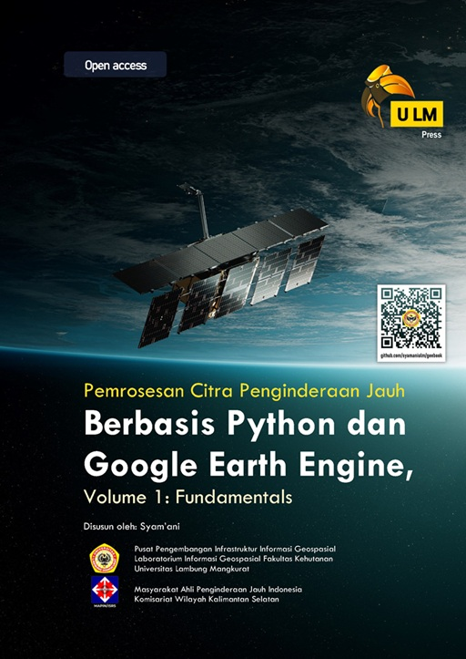
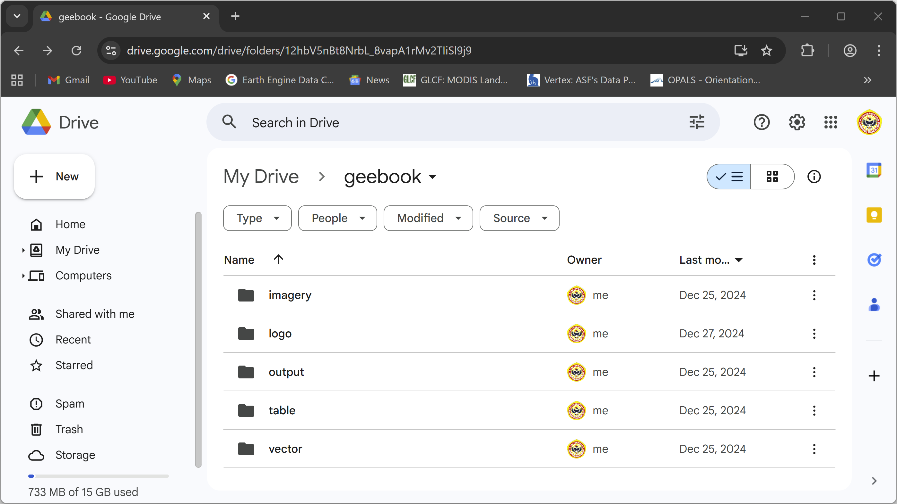

<html>
  <body>
    <div>
      
    </div>
  </body>
</html>

# Instruksi Penggunaan Buku
Buku **Pemrosesan Citra Penginderaan Jauh Berbasis Python dan Google Earth Engine, Volume 1: Fundamentals**  ditulis sejak Mei 2024, dan telah terbit pada Agustus 2025. Buku lanjutannya, yaitu volume 2, direncanakan akan menyusul terbit pada tahun 2026. Buku ini digratiskan untuk digunakan oleh publik, termasuk data geospasial dan kode-kode yang menyertainya.<br/><br/>

Buku volume 1 memuat sekitar 30% teori dan 70% praktik. Sehingga, untuk mengikuti tutorial yang ada di dalam buku langkah demi langkah, Anda harus mengunduh paket data geospasial yang disediakan di repositori ini terlebih dahulu. Silahkan klik tombol **Code --> Download ZIP**, sebagaimana terlihat pada gambar berikut:<br/>

<html>
  <body>
    <div>
      
    </div>
  </body>
</html>

<br/>Data akan terunduh dalam bentuk file ZIP, sehingga harus diekstrak terlebih dahulu. Setelah diekstrak, ambil folder ```geebook``` yang ada di dalam folder hasil ekstraksi, kemudian tempatkan pada local drive Anda (misalnya drive D), atau unggah ke dalam Google Drive Anda. Jika Anda ingin mengoperasikan Google Earth Engine menggunakan *cloud*, yaitu Google Colab, maka folder ```geebook``` wajib Anda unggah ke Google Drive. Dan jika Anda menjalankan Google Earth Engine menggunakan JupyterLab atau VS Code yang terinstal di komputer Anda, maka folder ```geebook``` juga harus tersimpan di komputer Anda.<br/>

Di dalam Microsoft Windows, struktur path data Anda direkomendasikan seperti ini:<br/>
```
D:\geebook
          \imagery
          \logo
          \output
          \table
          \vector
```

Untuk sistem operasi lain, e.g. GNU/Linux atau Apple macOS, lokasinya dapat menyesuaikan. Dan untuk Google Drive, folder ```geebook``` yang sudah diekstrak diunggah ke dalam ```My Drive```. Sebagaimana terlihat pada gambar berikut:<br/>

<html>
  <body>
    <div>
      
    </div>
  </body>
</html>

### Kloning repositori menggunakan Git
Jika Anda sudah menginstal software Git (https://git-scm.com/) di komputer Anda, Anda dapat secara langsung mengkloning repositori ini melalui terminal/command prompt. Caranya, via terminal/command prompt, masuk terlebih dahulu ke dalam drive atau folder yang nantinya akan dijadikan tempat untuk menyimpan folder ```geebook```. Kemudian dalam posisi online, ketikkan dan eksekusi perintah berikut:<br/>
```
git clone https://github.com/syamaniulm/geebook
```

Proses kloning otomatis menggunakan Git akan mengunduh repositori ini secara keseluruhan, tidak hanya folder ```geebook```. Untuk selanjutnya, Anda cukup ambil folder ```geebook``` saja dari folder hasil kloning, untuk diunggah ke Google Drive atau ditempatkan di drive D misalnya.

## Penafian
Python, Google Earth Engine, Google Colab, dan perangkat lunak terkait akan terus berkembang setiap saat. Sebagai konsekuensinya, akan sangat mungkin bahwa pada saat Anda membaca beberapa bagian buku ini, langkah-langkah teknis yang disajikan sudah ketinggalan atau tidak berlaku lagi. Oleh karena itu, Anda direkomendasikan untuk menelusuri sendiri referensi-referensi terbaru untuk bagian-bagian yang sudah ketinggalan tersebut.
#

## Petunjuk Sitasi

***APA Style:***<br/>
Syam’ani. (2025). Pemrosesan Citra Penginderaan Jauh Berbasis Python dan Google Earth Engine, Volume 1: Fundamentals. Banjarmasin: ULM Press.<br/>
### BibTeX
```
@book{syamani2025,
  title     = "Pemrosesan Citra Penginderaan Jauh Berbasis Python dan Google Earth Engine, Volume 1: Fundamentals",
  author    = "Syam'ani",
  month     = "Agustus",
  year      = 2025,
  publisher = "ULM Press",
  address   = "Banjarmasin",
  isbn      = "978-634-7195-31-9"
}
```

### RIS
```
TY  - BOOK
AU  - Syam'ani, 
TI  - Pemrosesan Citra Penginderaan Jauh Berbasis Python dan Google Earth Engine, Volume 1: Fundamentals
PY  - 2025
DA  - Agustus
PB  - ULM Press
CY  - Banjarmasin
SN  - 9786347195319
ER  - 
```
#

Syam'ani<br/>
Laboratorium Informasi Geospasial<br/>
Fakultas Kehutanan<br/>
Universitas Lambung Mangkurat
#
<br/>
<html>
<body>
  <div class="social-icons">
    <a href="https://www.instagram.com/syamani_ulm">
      
    </a>
    <a href="https://web.facebook.com/syamani.ulm">
      
    </a>
    <a href="https://linkedin.com/in/syamaniulm">
      
    </a>
    <a href="https://www.youtube.com/c/geospatialcorner">
      
    </a>
  </div>
</body>
</html>

