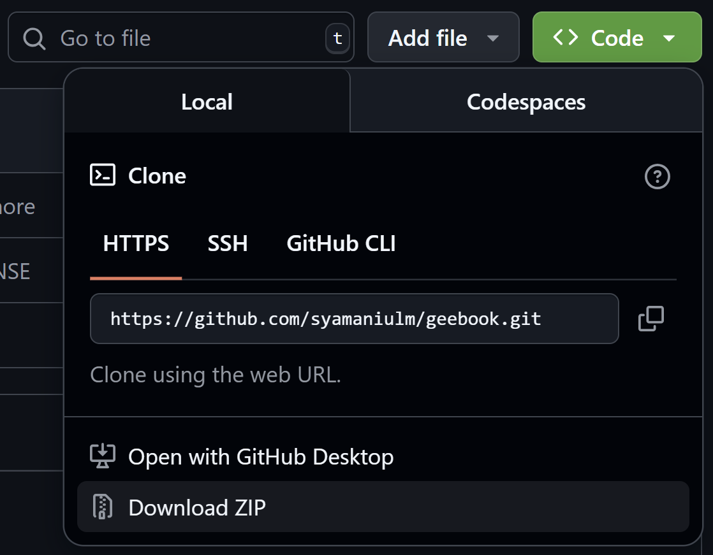

# Instruksi Penggunaan Buku
Buku direncanakan terdiri atas 2 volume. Volume 1, yang berjudul **Pemrosesan Citra Penginderaan Jauh Berbasis Python dan Google Earth Engine, Volume 1: Fundamentals**, terbit pada Agustus 2025. Sementara volume 2 direncanakan akan menyusul terbit pada tahun 2026.<br/><br/>

Untuk mengikuti tutorial yang ada di dalam buku langkah demi langkah, Anda harus mengunduh paket data geospasial yang disediakan di repositori ini terlebih dahulu. Silahkan klik tombol Code --> Download ZIP, sebagaimana terlihat pada gambar berikut:<br/>

<html>
  <body>
    <div>
      
    </div>
  </body>
</html>

<br/>Data akan terunduh dalam bentuk file ZIP, sehingga harus diekstrak terlebih dahulu. Setelah diekstrak, ambil folder ```geebook``` yang ada di dalam folder hasil ekstraksi, kemudian tempatkan pada local drive Anda (misalnya drive D), atau unggah ke dalam Google Drive Anda.<br/><br/>

### Cloning repositori menggunakan Git

Jika Anda sudah menginstal software Git (https://git-scm.com/) di komputer Anda, Anda dapat secara langsung mengkloning repositori ini melalui terminal/command prompt. Caranya, via terminal/command prompt, masuk terlebih dahulu ke dalam drive atau folder yang nantinya akan dijadikan tempat untuk menyimpan folder ```geebook```. Kemudian dalam posisi online, ketikkan dan eksekusi perintah berikut:<br/><br/>
```git clone https://github.com/syamaniulm/geebook```<br/><br/>

Syam'ani<br/>
Universitas Lambung Mangkurat<br/>

<html>
<body>
  <div class="social-icons">
    <a href="https://www.instagram.com/syamani_ulm">
      
    </a>
    <a href="https://web.facebook.com/syamani.ulm">
      
    </a>
    <a href="https://linkedin.com/in/syamaniulm">
      
    </a>
    <a href="https://www.youtube.com/c/geospatialcorner">
      
    </a>
  </div>
</body>
</html>

